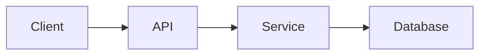

> Este arquivo é uma referência estrutural e editorial.
> Seus exemplos, comandos, tecnologias e trechos ilustrativos não devem ser reutilizados como fatos do projeto sem evidência verificável no workspace.

# 🚀 Nome do Projeto

<p align="center">
  
</p>

<p align="center">
  <b>✨ Uma frase clara e impactante sobre o projeto</b>

  <i>Ex: Plataforma para gerenciamento de eventos culturais em larga escala</i>
</p>

<p align="center">
  
  
  
</p>

---

## 📚 Sumário

* [🧠 Sobre](#-sobre)
* [⚡ Quick Start](#-quick-start)
* [📸 Preview](#-preview)
* [🧩 Funcionalidades](#-funcionalidades)
* [🛠️ Tecnologias](#️-tecnologias)
* [📦 Uso](#-uso)
* [🏗️ Arquitetura](#️-arquitetura)
* [📂 Estrutura](#-estrutura-do-projeto)
* [🔐 Variáveis de Ambiente](#-variáveis-de-ambiente)
* [🧪 Testes](#-testes)
* [🚀 Deploy](#-deploy)
* [🤝 Contribuição](#-como-contribuir)
* [📄 Licença](#-licença)

---

## 🧠 Sobre

Explique claramente:

* Problema que resolve
* Público-alvo
* Diferencial

> 💡 Este projeto permite que [X] faça [Y] de forma mais eficiente através de [Z].

---

## ⚡ Quick Start

```bash
git clone https://github.com/seu-user/seu-repo.git
cd seu-repo
npm install
npm start
```

---

## 📸 Preview


---

## 🧩 Funcionalidades

* ✅ Feature principal
* ✅ Integração com X
* 🚧 Em desenvolvimento
* 🔒 Restrito

---

## 🛠️ Tecnologias

* Node.js
* Docker
* PostgreSQL
* Azure DevOps

---

## 📦 Uso

Exemplo real:

```bash
curl -X GET http://localhost:3000/api/events
```

Ou:

```js
const result = await api.getEvents();
```

---

## 🏗️ Arquitetura



---

## 📂 Estrutura do Projeto

```tree
src/
 ├── controllers/
 ├── services/
 ├── models/
 └── config/
```

---

## 🔐 Variáveis de Ambiente

```env
DB_HOST=localhost
DB_USER=root
DB_PASS=123
```

---

## 🧪 Testes

```bash
npm test
```

---

## 🚀 Deploy

* Docker
* Kubernetes
* Azure DevOps Pipelines

---

## 🤝 Como contribuir

1. Fork
2. Branch (`feature/nome`)
3. Commit (`feat: ...`)
4. PR

---

## 📄 Licença

MIT License
 